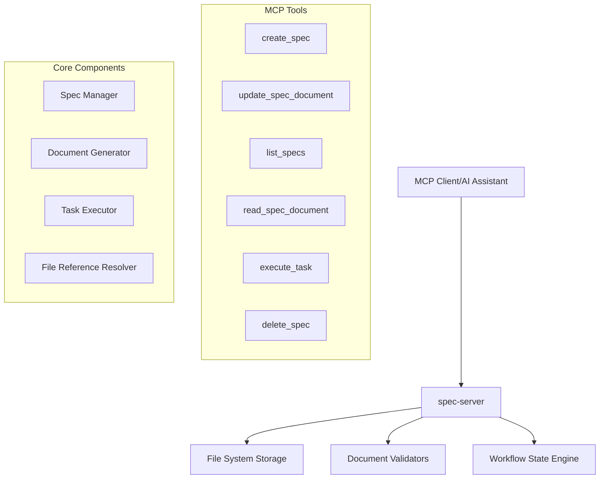

# Design Document

## Overview

The spec-server is a FastMCP-based server that implements a structured feature development workflow. It provides MCP tools for creating, managing, and executing feature specifications through a three-phase process: Requirements → Design → Implementation Tasks. The server maintains state through the filesystem and provides a systematic approach to feature development for AI assistants.

## Architecture

### High-Level Architecture



### Technology Stack

- **FastMCP**: Python framework for building MCP servers
- **Python 3.12.10+**: Core runtime
- **Pydantic**: Data validation and serialization
- **Pathlib**: File system operations
- **Markdown**: Document format
- **JSON**: Configuration and state management
- **MCP Transport**: Support for both stdio and SSE (Server-Sent Events) transport methods

## Components and Interfaces

### 1. MCP Tools Interface

The server exposes the following MCP tools:

#### create_spec
- **Purpose**: Initialize a new feature specification
- **Explanation**: This tool creates a new spec directory structure and generates an initial requirements document based on the user's rough idea. It validates that the feature name doesn't already exist and follows kebab-case naming conventions. The tool uses the DocumentGenerator to create a properly formatted requirements.md file with user stories and EARS-format acceptance criteria.
- **Parameters**:
  - `feature_name` (string): Kebab-case feature identifier
  - `initial_idea` (string): User's rough feature description
- **Returns**: Created spec metadata and initial requirements document

#### update_spec_document
- **Purpose**: Update requirements, design, or tasks documents
- **Explanation**: This tool handles document updates within the three-phase workflow. It validates phase transitions, ensuring users can only advance after explicit approval. The tool works with the WorkflowEngine to enforce proper progression through Requirements → Design → Tasks phases. It also handles document format validation and maintains workflow state.
- **Parameters**:
  - `feature_name` (string): Target spec identifier
  - `document_type` (enum): "requirements" | "design" | "tasks"
  - `content` (string): Updated document content
  - `phase_approval` (boolean): Whether user approves current phase
- **Returns**: Updated document content and next phase status

#### list_specs
- **Purpose**: List all existing specifications with status
- **Explanation**: This tool scans the specs directory and returns metadata about all existing specifications. It determines the current phase of each spec by checking which documents exist and their completion status. The tool also calculates task progress by parsing tasks.md files and counting completed vs total tasks.
- **Parameters**: None
- **Returns**: Array of spec metadata with current phase and completion status

#### read_spec_document
- **Purpose**: Retrieve content of spec documents
- **Explanation**: This tool provides read access to any of the three spec documents (requirements, design, tasks). It includes file reference resolution, meaning any `#[[file:path]]` references in the documents are resolved and their content is included. The tool also returns metadata about the document's last modification time and current phase status.
- **Parameters**:
  - `feature_name` (string): Target spec identifier
  - `document_type` (enum): "requirements" | "design" | "tasks"
- **Returns**: Document content with metadata

#### execute_task
- **Purpose**: Execute a specific implementation task
- **Explanation**: This tool handles the execution of individual tasks from the implementation plan. It reads all three spec documents to provide full context, parses the tasks.md file to find the specified task, and updates task status. The tool ensures that sub-tasks are completed before parent tasks and provides execution context including requirements references and design details.
- **Parameters**:
  - `feature_name` (string): Target spec identifier
  - `task_identifier` (string): Task number/identifier
- **Returns**: Task execution results and updated status

#### delete_spec
- **Purpose**: Remove a specification entirely
- **Explanation**: This tool removes a complete specification including all its documents and metadata. It performs cleanup operations to ensure no orphaned files remain and updates any cached state. The tool includes safety checks to prevent accidental deletion and provides confirmation of what was removed.
- **Parameters**:
  - `feature_name` (string): Target spec identifier
- **Returns**: Deletion confirmation

### 2. Core Components

#### SpecManager
**Explanation**: The SpecManager is the primary interface for spec lifecycle management. It handles all file system operations for specs, including directory creation, metadata tracking, and cleanup. The component maintains a registry of all specs and their current states, providing efficient access patterns for listing and retrieval operations.

```python
class SpecManager:
    def __init__(self, base_path: Path = Path("specs"))
    def create_spec(self, feature_name: str, initial_idea: str) -> Spec
    def get_spec(self, feature_name: str) -> Spec
    def list_specs(self) -> List[SpecMetadata]
    def delete_spec(self, feature_name: str) -> bool
```

#### DocumentGenerator
**Explanation**: The DocumentGenerator creates properly formatted specification documents based on templates and user input. It enforces document structure standards, including EARS format for requirements, specific section layouts for design documents, and checkbox formatting for tasks. The component also handles document validation to ensure consistency across all generated specs.

```python
class DocumentGenerator:
    def generate_requirements(self, initial_idea: str) -> str
    def generate_design(self, requirements: str) -> str
    def generate_tasks(self, requirements: str, design: str) -> str
    def validate_document_format(self, doc_type: str, content: str) -> bool
```

#### WorkflowEngine
**Explanation**: The WorkflowEngine enforces the three-phase workflow progression (Requirements → Design → Tasks). It tracks the current phase of each spec, validates phase transitions, and ensures users cannot skip phases without proper approval. The engine maintains workflow state and provides safeguards against invalid transitions that could compromise the spec development process.

```python
class WorkflowEngine:
    def get_current_phase(self, spec: Spec) -> Phase
    def can_advance_phase(self, spec: Spec, approval: bool) -> bool
    def advance_phase(self, spec: Spec) -> Phase
    def validate_phase_transition(self, from_phase: Phase, to_phase: Phase) -> bool
```

#### TaskExecutor
**Explanation**: The TaskExecutor manages the execution of individual implementation tasks from the tasks.md file. It parses task hierarchies, tracks completion status, and provides execution context by combining information from all three spec documents. The component ensures proper task ordering (sub-tasks before parent tasks) and maintains task state persistence.

```python
class TaskExecutor:
    def parse_tasks(self, tasks_content: str) -> List[Task]
    def get_next_task(self, tasks: List[Task]) -> Optional[Task]
    def update_task_status(self, task_id: str, status: TaskStatus) -> bool
    def execute_task_context(self, spec: Spec, task: Task) -> ExecutionContext
```

## Data Models

The spec-server uses a hierarchical data model centered around the `Spec` entity, which represents a complete feature specification. The model supports a three-phase workflow where each phase has specific document requirements and validation rules.

**Model Relationships:**
- A `Spec` contains metadata and references to three document files (requirements.md, design.md, tasks.md)
- Each `Spec` has a current `Phase` that determines which operations are allowed
- The `tasks.md` file contains multiple `Task` objects with hierarchical relationships (parent/sub-task)
- `SpecMetadata` provides a lightweight view of specs for listing operations without loading full content
- `DocumentTemplate` defines the structure and validation rules for each document type
- `FileReference` objects handle the resolution of `#[[file:path]]` references within documents

**Workflow State Management:**
The model enforces strict phase progression where users must explicitly approve each phase before advancing. This ensures proper review and validation at each stage of the specification development process.

### Core Models

```python
from pydantic import BaseModel
from enum import Enum
from typing import List, Optional
from pathlib import Path

class Phase(Enum):
    """Represents the current phase of a specification in the workflow."""
    REQUIREMENTS = "requirements"  # Initial phase - gathering and defining requirements
    DESIGN = "design"             # Second phase - creating technical design
    TASKS = "tasks"               # Final phase - implementation task planning
    COMPLETE = "complete"         # All phases completed and approved

class TaskStatus(Enum):
    """Tracks the completion status of individual implementation tasks."""
    NOT_STARTED = "not_started"   # Task has not been started
    IN_PROGRESS = "in_progress"   # Task is currently being worked on
    COMPLETED = "completed"       # Task has been finished

class Spec(BaseModel):
    """Core model representing a complete feature specification."""
    feature_name: str             # Kebab-case identifier for the feature
    current_phase: Phase          # Current workflow phase
    created_at: str              # ISO timestamp of spec creation
    updated_at: str              # ISO timestamp of last modification
    base_path: Path              # File system path to spec directory

    def get_requirements_path(self) -> Path:
        """Returns path to requirements.md file"""
        return self.base_path / "requirements.md"

    def get_design_path(self) -> Path:
        """Returns path to design.md file"""
        return self.base_path / "design.md"

    def get_tasks_path(self) -> Path:
        """Returns path to tasks.md file"""
        return self.base_path / "tasks.md"

class SpecMetadata(BaseModel):
    """Lightweight model for listing specs without loading full content."""
    feature_name: str             # Kebab-case identifier for the feature
    current_phase: Phase          # Current workflow phase
    has_requirements: bool        # Whether requirements.md exists
    has_design: bool             # Whether design.md exists
    has_tasks: bool              # Whether tasks.md exists
    task_progress: Optional[str]  # Progress summary like "3/10 completed"

class Task(BaseModel):
    """Represents an individual implementation task from tasks.md."""
    identifier: str              # Task number like "1.2" or "3"
    description: str             # Task description/objective
    requirements_refs: List[str] # References to specific requirements
    status: TaskStatus           # Current completion status
    parent_task: Optional[str]   # Parent task identifier if this is a sub-task
    sub_tasks: List[str]         # List of sub-task identifiers

class DocumentTemplate(BaseModel):
    """Template configuration for generating spec documents."""
    template_type: str           # Type: "requirements", "design", or "tasks"
    sections: List[str]          # Required sections for this document type
    format_rules: dict           # Formatting rules and validation patterns
```

### File Reference System

```python
class FileReference(BaseModel):
    reference_text: str  # "#[[file:path/to/file.md]]"
    file_path: Path
    resolved_content: Optional[str]

class FileReferenceResolver:
    def extract_references(self, content: str) -> List[FileReference]
    def resolve_reference(self, ref: FileReference) -> str
    def substitute_references(self, content: str) -> str
```

## Error Handling

### Error Categories

1. **Validation Errors**: Invalid parameters, malformed documents
2. **File System Errors**: Missing files, permission issues
3. **Workflow Errors**: Invalid phase transitions, missing dependencies
4. **MCP Protocol Errors**: Tool call failures, connection issues

### Error Response Format

```python
class SpecError(Exception):
    error_code: str
    message: str
    details: Optional[dict]
    suggestions: List[str]

# Example error responses
ERRORS = {
    "SPEC_EXISTS": {
        "message": "Specification already exists",
        "suggestions": ["Use update_spec_document to modify existing spec"]
    },
    "INVALID_PHASE_TRANSITION": {
        "message": "Cannot advance to next phase without approval",
        "suggestions": ["Provide explicit approval for current phase"]
    },
    "MISSING_DEPENDENCIES": {
        "message": "Required documents missing for this operation",
        "suggestions": ["Create requirements document first"]
    }
}
```

## Testing Strategy

### Unit Testing

1. **Component Tests**:
   - SpecManager CRUD operations
   - DocumentGenerator format validation
   - WorkflowEngine phase transitions
   - FileReferenceResolver parsing and resolution

2. **Document Format Tests**:
   - EARS format validation
   - Markdown structure verification
   - Task checkbox format validation
   - File reference syntax parsing

### Integration Testing

1. **MCP Tool Tests**:
   - End-to-end tool call workflows
   - Parameter validation
   - Error response handling
   - State persistence across calls

2. **Workflow Tests**:
   - Complete spec creation workflow
   - Phase transition validation
   - Task execution scenarios
   - File reference resolution

### Test Data Structure

```
tests/
├── unit/
│   ├── test_spec_manager.py
│   ├── test_document_generator.py
│   ├── test_workflow_engine.py
│   └── test_file_references.py
├── integration/
│   ├── test_mcp_tools.py
│   ├── test_workflows.py
│   └── test_task_execution.py
├── fixtures/
│   ├── sample_specs/
│   ├── test_documents/
│   └── reference_files/
└── conftest.py
```

### Performance Considerations

1. **File System Optimization**:
   - Lazy loading of spec documents
   - Caching of frequently accessed specs
   - Efficient directory scanning for list operations

2. **Memory Management**:
   - Stream processing for large documents
   - Cleanup of resolved file references
   - Bounded cache sizes

3. **Concurrent Access**:
   - File locking for write operations
   - Atomic document updates
   - Race condition prevention

## Implementation Notes

### FastMCP Integration

The server will use FastMCP's decorator-based tool registration with support for both transport methods:

```python
from fastmcp import FastMCP

# Initialize server with transport configuration
mcp = FastMCP("spec-server")

@mcp.tool()
def create_spec(feature_name: str, initial_idea: str) -> dict:
    # Implementation
    pass

# Support both transport methods
if __name__ == "__main__":
    import sys
    import asyncio

    # Check if running via stdio (default MCP transport)
    if len(sys.argv) == 1 or sys.argv[1] == "stdio":
        # Run with stdio transport
        mcp.run()
    elif sys.argv[1] == "sse":
        # Run with SSE transport on specified port
        port = int(sys.argv[2]) if len(sys.argv) > 2 else 8000
        mcp.run_sse(port=port)
```

### File System Layout

```
specs/
├── feature-name-1/
│   ├── requirements.md
│   ├── design.md
│   └── tasks.md
├── feature-name-2/
│   ├── requirements.md
│   └── design.md
└── .spec-metadata.json  # Server state tracking
```

### Configuration

Server configuration through environment variables and optional config file:

```python
# Environment variables
SPECS_BASE_PATH = "specs"
SPECS_SERVER_PORT = 8000
SPECS_LOG_LEVEL = "INFO"

# Optional specs/config.json
{
    "document_templates": {...},
    "validation_rules": {...},
    "file_reference_patterns": [...]
}
```
